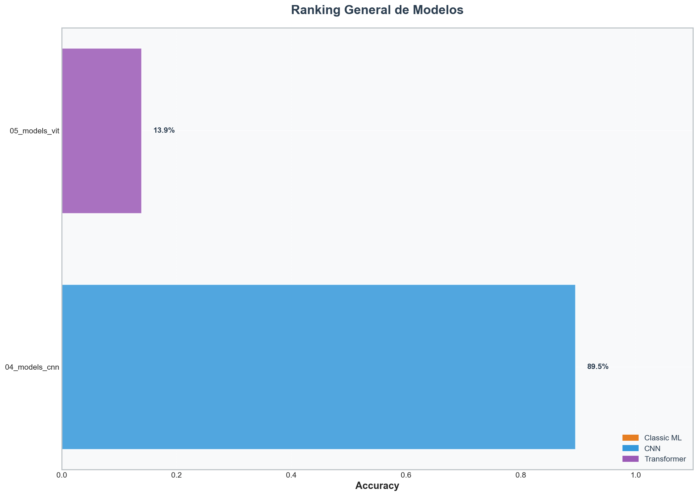
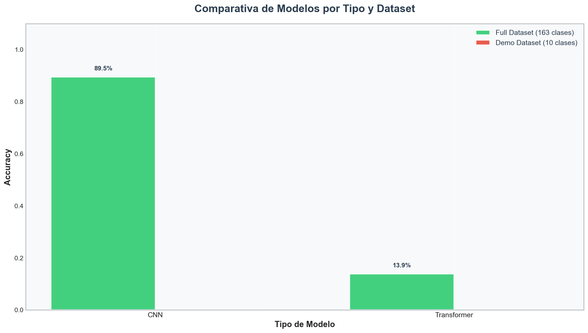
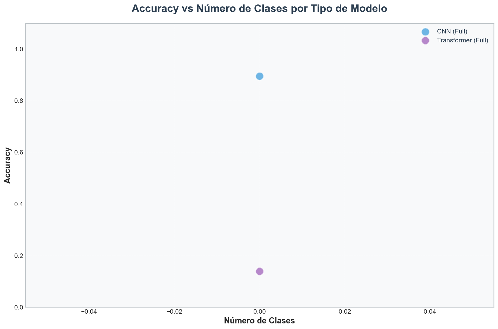

# 📊 Reporte de Comparativa de Modelos

**Fecha de generación:** 2026-02-03 20:05:07

**Total de modelos analizados:** 2

---

## 🏆 Resumen Ejecutivo

### Mejor Modelo (Dataset Completo - 163 clases)

- 🎯 **Modelo:** `04_models_cnn`
- 🧠 **Tipo:** MobileNetV3
- ⭐ **Accuracy:** **89.52%**
- 📊 **Clases:** 0

---

## 📋 Modelos Analizados

### 🌳 Modelos FULL (163 clases)

| Modelo | Tipo | Clases | Accuracy | Épocas |
|--------|------|--------|----------|--------|
| 04_models_cnn | MobileNetV3 | 0 | 89.52% | 10 |
| 05_models_vit | ViT-B/16 | 0 | 13.89% | - |

---

## 📈 Visualizaciones

### Ranking General

### Comparativa por Tipo de Modelo

### Accuracy vs Número de Clases

---

## 💡 Análisis y Conclusiones

### Por Tipo de Modelo

- **CNN:** Accuracy promedio = **89.52%**
- **Transformer:** Accuracy promedio = **13.89%**

### Estadísticas Generales

- **Accuracy promedio (Dataset Completo):** 51.71%

---

*Reporte generado automáticamente por `06_analyze_metrics.py`*
